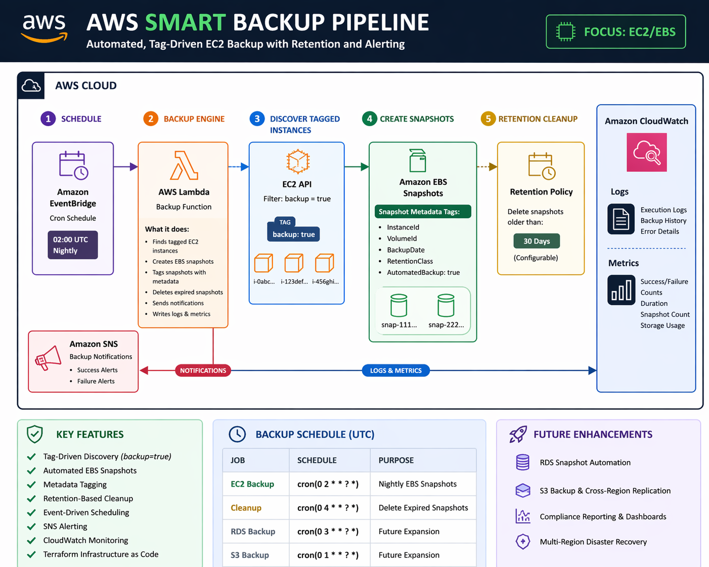

# AWS Smart Backup Pipeline

## Problem

Businesses lose money and operational continuity when critical EC2-hosted workloads are not backed up consistently, tagged clearly, or cleaned up intelligently. Manual snapshot management is error-prone, expensive when forgotten, and invisible when it fails.

## Solution

An event-driven AWS backup system that protects tagged EC2 workloads from data loss through automated EBS snapshots, retention-based cleanup, failure alerting, and operational monitoring.

The architecture is designed to expand into broader backup coverage for RDS and S3-based redundancy as the platform matures.

## Architecture

```
EventBridge (cron schedule)
       │
       ▼
Lambda Backup Function
       │
       ├──▶ Discover EC2 instances tagged backup=true
       │
       ├──▶ Create EBS snapshots with metadata tags
       │         • InstanceId
       │         • VolumeId
       │         • BackupDate
       │         • RetentionClass
       │
       ├──▶ Delete expired snapshots (retention policy)
       │
       ├──▶ SNS alerts (success / failure)
       │
       └──▶ CloudWatch logs + metrics
```



## How It Works

1. **EventBridge** triggers the backup Lambda on a nightly cron schedule
2. **Lambda** queries EC2 for instances tagged `backup=true`
3. For each matching instance, **EBS snapshots** are created for every attached volume
4. Each snapshot is **tagged with metadata** (instance ID, volume ID, backup date, automated flag)
5. A separate **cleanup run** deletes snapshots older than the configured retention period
6. **SNS** sends notifications on backup completion or failure
7. **CloudWatch** captures execution logs for operational visibility

## Features

- ✅ Tag-driven EC2 instance discovery (`backup=true`)
- ✅ Automated EBS snapshot creation with metadata tagging
- ✅ Retention-based snapshot cleanup
- ✅ SNS failure and completion alerts
- ✅ CloudWatch logging and monitoring
- ✅ EventBridge scheduled execution
- ✅ Terraform-managed infrastructure
- ✅ Disaster recovery restore workflows

## Expansion Modules (Secondary)

- RDS snapshot automation
- S3 bucket backup to centralized storage with lifecycle policies (Glacier → Deep Archive)
- Cross-region replication (planned)
- Compliance reporting (planned)

## Project Structure

```
├── src/
│   ├── backup_manager.py      # Core backup logic (EC2-primary, RDS/S3 secondary)
│   ├── lambda_handler.py      # Lambda entry point with event routing
│   └── restore_manager.py     # Disaster recovery restore workflows
├── infra/
│   ├── main.tf                # Terraform config
│   ├── lambda.tf              # Lambda function resource
│   ├── eventbridge.tf         # Scheduled triggers
│   ├── iam.tf                 # Least-privilege IAM roles
│   ├── variables.tf           # Configurable parameters
│   └── outputs.tf             # Deployment outputs
├── config/
│   └── backup_schedule.json   # Schedule and resource filter config
├── tests/
│   ├── test_backup_pipeline.py  # Integration tests (moto)
│   └── test_local.py            # Unit tests (mock-based)
├── scripts/
│   ├── deploy.sh              # Deployment automation
│   └── check_backup_status.py # Operational status checker
└── docs/
    ├── ARCHITECTURE.md        # Detailed architecture documentation
    ├── SETUP_GUIDE.md         # Step-by-step setup instructions
    └── iam_policies.json      # IAM policy reference
```

## Quick Start

### Prerequisites

- AWS CLI configured with appropriate permissions
- Python 3.9+
- Terraform >= 1.5 (for infrastructure deployment)

### 1. Clone and Install

```bash
git clone https://github.com/LordSesay/aws-data-backup-pipeline.git
cd aws-data-backup-pipeline
pip install -r requirements.txt
```

### 2. Configure Environment

```bash
cp .env.example .env
# Edit .env with your AWS region, backup bucket, SNS topic ARN
```

### 3. Tag EC2 Instances for Backup

```bash
aws ec2 create-tags \
    --resources i-0abc123def456 \
    --tags Key=backup,Value=true
```

### 4. Deploy Infrastructure

```bash
cd infra
terraform init
terraform plan
terraform apply
```

### 5. Test

```bash
python -m pytest tests/ -v
```

## Lambda Entry Point

`src.lambda_handler.lambda_handler`

Supported event payloads:

```json
{ "backup_type": "ec2" }
{ "backup_type": "cleanup" }
{ "backup_type": "rds" }
{ "backup_type": "s3" }
{ "backup_type": "full" }
```

Default (no payload or unknown type): runs EC2 backup.

## Configuration

### Environment Variables

| Variable | Description | Default |
|----------|-------------|---------|
| `AWS_REGION` | Target AWS region | `us-east-1` |
| `BACKUP_BUCKET` | S3 bucket for backup storage | `aws-backup-pipeline-{account-id}` |
| `SNS_TOPIC_ARN` | SNS topic for alerts | Required |
| `BACKUP_RETENTION_DAYS` | Days to retain snapshots | `30` |

### Backup Schedule (EventBridge)

| Job | Schedule | Description |
|-----|----------|-------------|
| EC2 Backup | `cron(0 2 * * ? *)` | Nightly EBS snapshots at 2 AM UTC |
| Cleanup | `cron(0 4 * * ? *)` | Delete expired snapshots at 4 AM UTC |
| RDS Backup | `cron(0 3 * * ? *)` | Nightly RDS snapshots (expansion) |
| S3 Backup | `cron(0 1 * * ? *)` | Nightly S3 sync (expansion) |

## Usage

### Manual Backup Trigger

```python
from src.backup_manager import BackupManager

backup = BackupManager()
result = backup.backup_ec2_instances()  # discovers tagged instances
```

### Restore from Snapshot

```python
from src.restore_manager import RestoreManager

restore = RestoreManager()
restore.restore_ec2_from_snapshot('snap-0abc123def456')
```

## Business Value

- **Reduces risk of data loss** — automated, scheduled, tag-scoped backups
- **Improves recovery readiness** — restore workflows with validation
- **Lowers manual overhead** — no human intervention for routine backups
- **Controls storage costs** — retention cleanup removes expired snapshots
- **Supports audit posture** — tagged snapshots, CloudWatch logs, SNS alerts

## Security

- IAM roles with least-privilege access
- Encryption at rest for all EBS snapshots
- CloudTrail integration for audit trails
- SNS alerting on failures

## Testing

```bash
# Full test suite
python -m pytest tests/ -v

# Local mock-based tests (no AWS credentials needed)
python tests/test_local.py
```

## License

MIT License — see [LICENSE](LICENSE)
